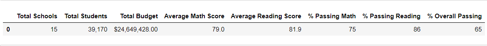
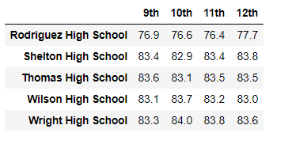
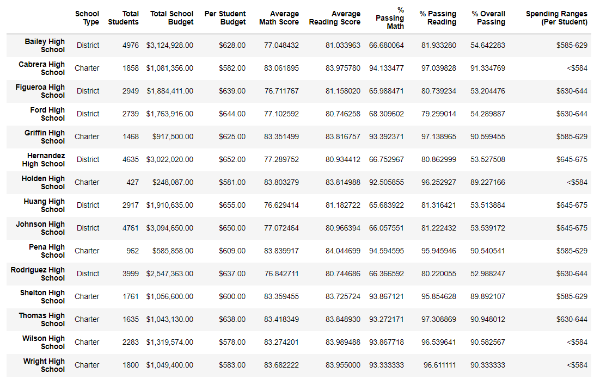

# School_District_Analysis

## Project Overview

Maria, the chief data scientist, has given the task to analyze all standardized tests for various school districts. The following deliverables for the analysis are:

1.  Create a table for a high-level snapshot of the district's key metrics.
2.  Create a table with an overview of the key metrics for each school.
3.  Generate metrics that respresent the following:

          a. Top 5 and bottom 5 performing schools, based on the overall passing rate
          b. The average math score received by students in each grade level at each school
          c. The average reading score received by students in each grade level at each school
          d. School performance based on the budget per student
          e. School performance based on the school size 
          f. School performance based on the type of school
          
## Resources
- Data Sources:  schools_complete.csv, student_complete.csv
- Software:  Python 3.7.6 ('base':conda), Visual Studio Code 1.46.1, Juypter Notebook

## Summary

Here is an overview of the school district analysis.

There are 39,170 numbers of students in 15 different schools in the district. The total budget of the schools in the district is $24,649,428. 29,370 students had a passing score in math. 33,610 students had a passing score in reading. There 75% of students passed the math standardized test, 86% passed the reading standardized test. The average math score and average reading scores of the district were 79 and 82. respectively. Below are snapshots of the math and reading scores per grade represented by schools in alphabetical order.

The analysis was performed to determine the top 5 and bottom 5 performing schools, based on the overall passing rate. See the charts below. 

Sorted out the school spending per student into four spending bins. Ranging from the lowest $578 to the highest amount of $655. After the schools were sorted, an analysis was performed to see how does the school spending per student affect the averages and passing percentages. Here is a list below of all schools.

Schools that were smaller in size had the highest passing averages. 

## Challenge Overview

After reviewing information, Maria's supervisor discovered the math and reading scores for ninth graders from a high school were incorrect. The following tasks for the analysis are:

1.  Replace the ninth-grade math and reading scores from Thomas High School.
2.  Keep all other data associated with the ninth-grade students and Thomas High School intact.
3.  After replacing the reading and math scores, generate metrics that respresent the following:

          a. How is the district summary affected
          b. How is the school summary affected?
          c. How does removing the ninth graders’ math and reading scores affect Thomas High School’s performance, relative to the other schools?
          d. How does removing the ninth grade scores affect the following -
                    - Math and Reading Scores by Grade -
                    - Scores by School Spending 
                    - Scores by School Size 
                    - Scores by School Type
         
## Summary
  
Here is an overview of the school district analysis after ninth grade math and reading scores from Thomas High School were replaced. 
  

The number of students didn't change in the 15 schools in the district. After the correction, 28,939 students passed math instead of 29,370. 33,158 students had a passing score in reading instead of 33,610. The percentage of passing decreased by roughly 1% for the math and reading scores. The average math score and average reading scores of the district were 79 and 82. respectively. Because of changes, Thomas high school is no longer in the top 5 schools of passing scores. 

